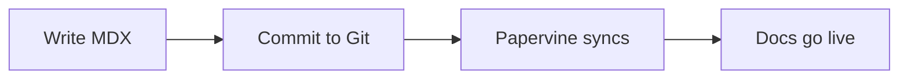

A quick tour of supported components.

<Note>Callouts like this render as styled admonitions.</Note>
<Warning>So do warnings.</Warning>

<Tabs>
  <Tab title="npm">`npm install`</Tab>
  <Tab title="pnpm">`pnpm install`</Tab>
</Tabs>

<Accordion title="Details">Accordions collapse long content.</Accordion>

A fenced `mermaid` block renders as a diagram — it follows the page's light/dark theme:

